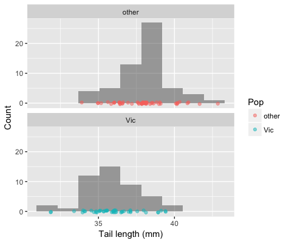

```{r setup, include=FALSE}
knitr::opts_chunk$set(echo = TRUE, prompt = FALSE, eval = TRUE, 
                      warning = TRUE, comment=NA, cache = FALSE,
                      fig.width = 6, fig.height = 4)
```


# Data set: Brushtail possums

Lindenmayer and colleagues (Lindenmayer DB et al. 1995, Australian Journal of Zoology 43, 449-458) studied morphological variation among populations of the mountain brushtail possum (*Trichosurus caninus*) in Australia. The investigators recorded variables about individual possum's sex, age, where they were collected, and a range of morphological measurements.

This data set is available as a Comma-Separated-Value (CSV) formatted spreadsheet via this link:
  * [lindemayer-possums.csv](https://github.com/Bio723-class/example-datasets/raw/master/lindenmayer-possums.csv)

You can use the `read_csv()` function defined in the `readr` package (part of the `tidyverse`) to create a data frame from a CSV file . 

```{r, message=FALSE, warning=FALSE}
library(tidyverse)
possums <- read_csv("https://tinyurl.com/lindenmayer-possums")
```


Notice that we read the CSV file directly from a remote file via a URL.  If instead, you wanted to load a local file on your computer you would specify the "path" -- i.e. the location on your hard drive where you stored the file.  For example, here is how I would load the same file if it was stored in the standard downloads directory on my Mac laptop:

```{r, eval = FALSE}
possums <- read_csv("/Users/pmagwene/Downloads/lindenmayer-possums.csv")
```

# Make your solutions computable

For each of the problem below (except in cases where you are asked to discuss your interpretaion) write R code blocks that will **compute appropriate solutions**. A good rule of thumb for judging whether your solution is appropriately "computable" is to ask yourself "If I added additional observations to this data set, would my code still compute the right solution?"

# Problems

1. What are the dimensions of the possums data set? [0.5 pt]

1. What are the names of the variables in the possum data set? [0.5 pt]

1. Sites where animals were collected were assigned a site number (variable `sites`). How *many* unique sites are there in the data set? [1 pt]

1. Animals were categorized as coming from two different populations (variable `Pop`). What are the *names* of the populations? [1 pt]

1. Possums in the study were assigned an "age category" (variable `age`). There are several samples with missing age information ('NA' values).  Read the help on the funtion `is.na()` and write code to compute the number of samples with missing age data.  HINT: the `sum()` applied to a Boolean vector counts the number of `TRUE` elements. [1 pt]

1. Create a histogram depicting the distribution of the tail length variable (`taill`). Make sure to pick an appropriate number of bins for your visualization. [1 pt]

1. Create a set of histograms depicting the distribution of tail lengths in the possums data set faceted by population. [1 pt]

1.  The documentation for `geom_histogram` (see `?geom_histogram`) suggests that a related visualization called "frequency polygons" is more suitable when you want to compare distributions across the levels of a categorical variable.  Frequency polygons are like histograms, but the counts are displayed with lines rather than bars. Create a frequency polygon (see `geom_freqpoly`) for the tail length variable,  indicating each Population by  line color (use `color` rather than `fill` in the `aes` mapping). [1 pt]

1. Create a figure that uses boxplots to compare `taill` in the two different populations. [1 pt]

1. Histograms can be usefully combined with strip/jitter plots as shown in the figure below. Reproduce the figure above using `geom_histogram` and `geom_jitter` layers. Hint: To get the jittered points to sit at the base of each histogram, set the y aesthetic to zero. [2 pt]

    ```{r, echo = FALSE, out.width = "400px", fig.align = "center", eval = TRUE, results = "show"}

```

1. Draw a scatter plot to depict the relationship between age (an ordered but discrete variable in this data) and total body length (`totlngth`). Make sure you plot age on the x-axis, and add a little bit of horizontal jitter to minimize overplotting. [1 pt]

1. Draw scatter plot showing the relationship between tail length and total body length, using jitter to minimize overplotting. [1 pt]

1. Redraw the previous scatter plot (tail length vs total body length) coloring the points by the population variable. [1 pt]

1. What trends or patterns within and between populations are suggested by the scatter plot of tail length vs total body length? [1 pt]

1. Recreate the combined scatter plot / 2D density plot of tail length vs total body length, shown below. Note that I've added a little bit of jitter and alpha-transparency to the drawn points.  Make sure to include titles, subtitles and axis labels. [2 pt]

    ```{r, echo = FALSE, out.width = "600px", fig.align = "center", eval = TRUE, results = "show"}

```

