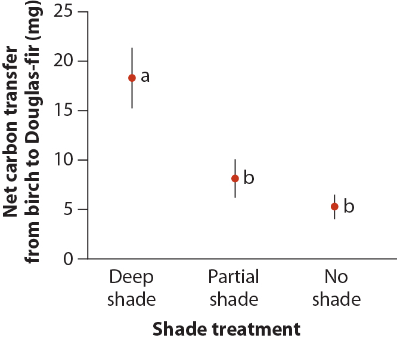

```{r setup, include=FALSE}
knitr::opts_chunk$set(echo = TRUE, prompt = FALSE, eval = FALSE, 
                      warning = TRUE, comment=NA, cache = FALSE,
                      fig.width = 6, fig.height = 4)
```

# Make your solutions computable

For each of the problem below (except in cases where you are asked to discuss your interpretaion) write R code blocks that will **compute appropriate solutions**. A good rule of thumb for judging whether your solution is appropriately "computable" is to ask yourself "If I added additional observations to this data set, would my code still compute the right solution?"


# Problems


How does caffeine in nectar affect visitation by pollinators? Singaravelan et al. (2005) set up feeding stations where bees were offered a choice between a control solution with 20% sucrose or a caffeinated solution with 20% sucroses plus some quantity of caffeine.  Four different caffeine treatment groups were studied: 50, 100, 150, and 200 ppm.  The response variable was the difference between the amount of nectar consumed from the caffeine feeders and that removed from the control feeders at the same station (measured in grams). 

The data from this study are available at [ABD-honeybee-caffeine.csv](https://github.com/bio304-class/bio304-fall2017/raw/master/datasets/ABD-honeybee-caffeine.csv)

Does the mean amount of nectar taken depend on the concentration of caffeine in the nectar? 


a. Draw a figure that illustrates  the relationship between the response variable and the treatment groups [2 pts]

a. Calculate the following summary statistics (without using the `aov()` or `lm()` functions): [1 pt each]
    - grand mean
    - sample size for each group
    - group means
    - $SS_\text{group}$
    - degrees of freedom associated with groups
    - $MS_\text{group}$
    - $SS_\text{error}$
    - degrees of freedom associated with variation within groups (error df)
    - $MS_\text{error}$    
    
a. What is the value of the $F$ test statistic for this example? [1 pt]

a. Find the p-value for your calculated $F$ statistic. [1 pt]

a. Carry out ANOVA of the honeybee data using the regression approach, using *effect coding*. You should get identical values of the F-statistic and associated p-value to what you obtained above.  What are the coefficients of the regression, and what is their interpretation? [3 pts]

a.  Use the Tukey HSD test to determine which pairs of groups are significantly different in their means. [2 pts]

a. Using ggplot, create a figure that plots the mean and 95% confidence intervals of the mean of the response variable for each treatment group (see below). The `geom_pointrange` function will be useful for this task. [3 pts] 

a. EXTRA CREDIT: Use the `ggplot2::annotate` function (see http://ggplot2.tidyverse.org/reference/annotate.html) to add alphabetic symbols to your plot to indicate  which pairs of means are significantly different from each other. The figure below illustrates this idea for a different data set [2 pts]

```{r, echo = FALSE, out.width = "350px", fig.align = "center", fig.cap = "Whitock & Schluter, Fig 15.4-1 -- Using symbols to indicate the outcome of Tukey-Kramer tests of all pairs of means. Two means are assigned a different symbol if they are significantly different (a vs. b) wherease means are assigned the same symbol (b in thise case) if they are not significantly different. ", eval = TRUE, results = "show"}

```


