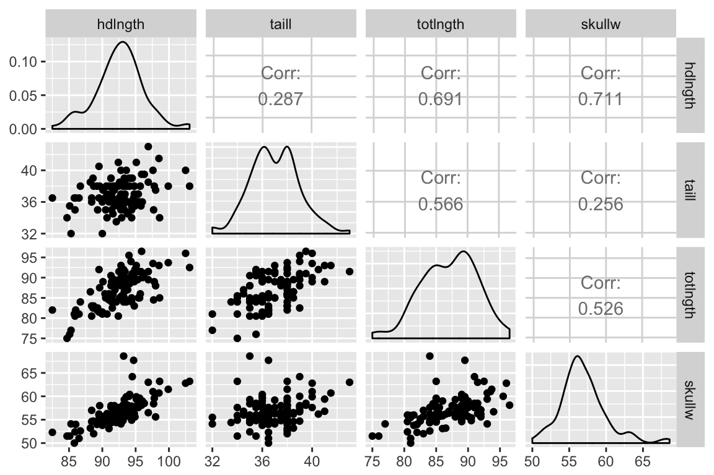
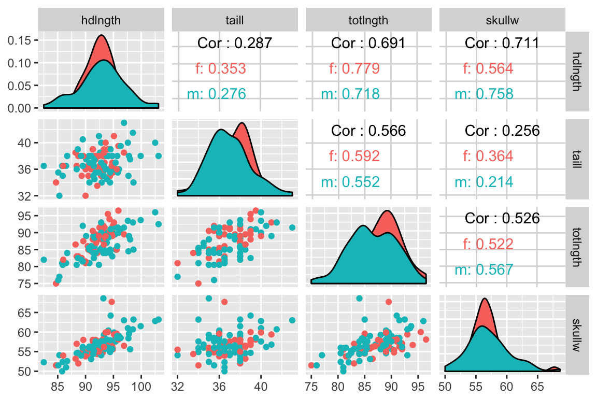

```{r setup, include=FALSE}
knitr::opts_chunk$set(echo = TRUE, prompt = FALSE, eval = FALSE, 
                      warning = TRUE, comment=NA, cache = FALSE,
                      fig.width = 6, fig.height = 4)
```

# Make your solutions computable

For each of the problem below (except in cases where you are asked to discuss your interpretaion) write R code blocks that will **compute appropriate solutions**. A good rule of thumb for judging whether your solution is appropriately "computable" is to ask yourself "If I added additional observations to this data set, would my code still compute the right solution?"

**Don't forget to include your library calls in your R Markdown document**


# Problems


1. In class we illustrated how to use ggplot calls to draw a representation of 2D vectors.  Write a function, `vec.draw()` that takes as input 2D vectors `x` and `y`, and which generates a vector plot like the one illustrated in Chapter 8 of the course notes.  Your function should return a ggplot plot object. [5 pts]

1. Write a function, `vec.proj()`, that takes two vectors, $\vec{x}$ and $\vec{y}$, and returns a list containing the projection of $\vec{y}$ on $\vec{x}$ and the component of $\vec{y}$ in $\vec{x}$ [5 pts]


    \[P_{\vec{x}}(\vec{y}) = \left(\frac{\vec{x} \cdot \vec{y}}{|\vec{x}|}\right) \frac{\vec{x}}{|\vec{x}|}\]
    and
    \[C_{\vec{x}}(\vec{y}) = \frac{\vec{x} \cdot \vec{y}}{|\vec{x}|}\]


  Using the test vectors given below, you should get output that resemble what is shown below:

  
    > x = [-3, -3, -1, -1, 0, 0, 1, 2, 2, 3] 
    > y = [-8, -5, -3, 0, -1, 0, 5, 1, 6, 5]
    > vec.proj(x, y)
    
    $proj
    [1] -6 -6 -2 -2  0  0  2  4  4  6

    $comp
    [1] 12.32883  
    

3. A very useful visualization of multiple bivariate relationships is a "pairs plot" in which all pairwise relationships between variables of interest are displayed (see below).  The package GGally provides a variety of extensions to ggplot including a powerful implementation of the pairs plot. Install GGally, read the [GGally documentation and examples](http://ggobi.github.io/ggally/index.html) for `GGally::ggpairs()` and then write code blocks to generate the following two plots depicting relationships between some of the variables in the examplar possums data set  that we've seen previously (see assignment 02) [5 pts]:

    ```{r, echo = FALSE, out.width = "400px", fig.align = "center", eval = TRUE, results = "show"}

```


    ```{r, echo = FALSE, out.width = "400px", fig.align = "center", eval = TRUE, results = "show"}

```
