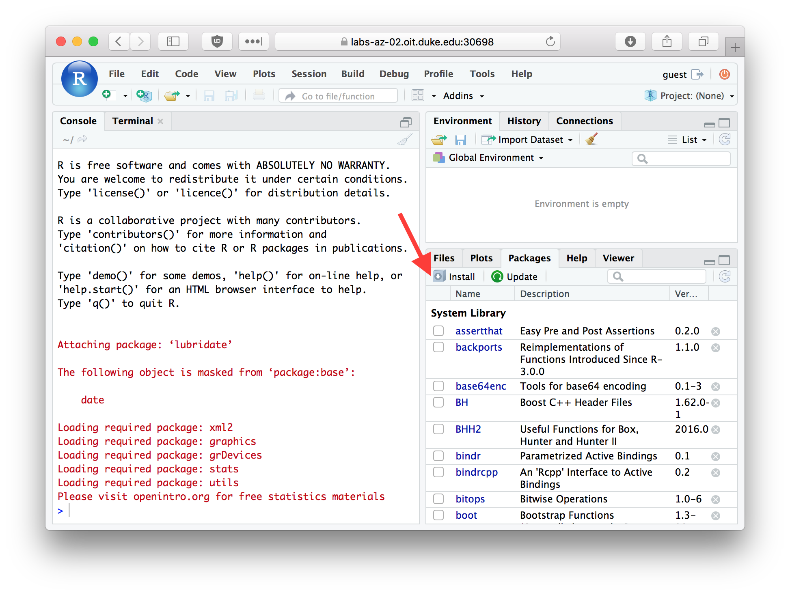

```{r setup, include=FALSE}
knitr::opts_chunk$set(echo = TRUE, prompt = TRUE, eval = TRUE, 
                      warning = FALSE, comment=NA, cache = FALSE,
                      fig.width = 6, fig.height = 4 )
```

  
# Packages
  
Packages are libraries of R functions and data that provide additional capabilities and tools beyond the standard library of functions included with R.  Hundreds of people around the world have developed packages for R that provide functions and related data structures  for conducting many different types of analyses.

Throughout this course you'll need to install a variety of packages. Here I show the basic procedure for installing new packages from the console as well as from the R Studio interface.

## Installing packages from the console

The built-in function `install.packages` provides a quick and conveniet way to install packages from the R console.  

### Install the tidyverse package

To illustrate the use of `install.package`, we'll install a collection of packages (a "meta-package") called the [tidyverse](http://www.tidyverse.org).  Here's how to install the tidyverse meta-package from the R console:

```{r, eval = FALSE}
install.packages("tidyverse", dependencies = TRUE)
```

The first argument to `install.packages` gives the names of the package we want to install. The second argument, `dependencies = TRUE`, tells R to install any additional packages that tidyverse depends on.


## Installing packages from the RStudio dialog

You can also install packages using a graphical dialog provided by RStudio. To do so pick the `Packages` tab in RStudio, and then click the `Install` button.  

```{r, echo = FALSE, out.width = "600px", fig.align = "center", fig.cap = "The Packages tab in RStudio"}

```

In the packages entry box you can type the name of the package you wish to install. 


### Install the stringr package

Let's install another useful package called "stringr".  Type the package name in the "Packages" field, make sure the "Install dependencies" check box is checked, and then press the "Install" button.

```{r, echo = FALSE, out.width = "300px", fig.align = "center", fig.cap = "Package Install Dialog"}
knitr::include_graphics("fig-rstudio-package-install-stringr.png")
```

## Loading packages

Once a package is installed on your computer, the package can be loaded into your R session using the `library` function.  To insure our previous install commands worked correctly, let's load the packages we just installed.

```{r, eval=FALSE}
library(stringr)
library(tidyverse)
```

Since the tidyverse pacakge is a "meta-package" it provides some additional info about the sub-packages that got loaded.  

When you load tidyverse, you will also see a message about "Conflicts" as several of the functions provided in the dplyr package (a sub-package in tidyverse) conflict with names of functions provided by the "stats" package which usually gets automically loaded when you start R.  The conflicting funcdtions are `filter` and `lag`. The conflicting functions in the stats package are `lag` and `filter` which are used in time series analysis.  The `dplyr` functions are  more generally useful. Furthermore, if you need these masked functions you can still access them by prefacing the function name with the name of the package (e.g. `stats::filter`).

